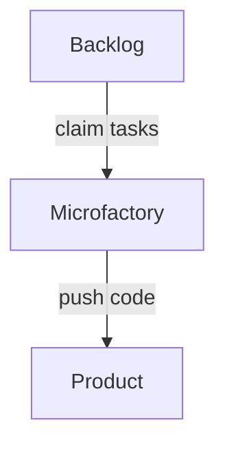

# Microfactory

An AI coding factory that fits in a Claude Code session. A plugin that turns a task backlog into a continuous stream of planned and implemented changes: agents pull issues from a task manager, implement them, and push code — continuously. Inspired by [AI Coding Factories](https://jaksa.wordpress.com/2025/08/07/ai-coding-factories/).

## How it works

No scripts, no containers, no daemon — the factory is a handful of markdown **skills**. A Claude Code session in your project claims an issue from your task manager, implements it, and pushes. Claude Code's `/loop` makes it repeat on an interval; the claim protocol (assign, wait, verify) makes several sessions safe to run side by side, because the task manager is the single source of truth.



## Installation

Install the plugin in Claude Code:

```
/plugin marketplace add https://github.com/jaksa76/microfactory
/plugin install microfactory
```

Backend prerequisites: `acli` for Jira, `gh` for GitHub Issues, nothing for the TODO.md backend.

## Setup

Open Claude Code in the project you want the factory to work on and run:

```
/microfactory:init-factory
```

It interviews you (backend, project, planning, branching and review policy, loop intervals), authenticates the backend CLI, writes `.microfactory/config.yaml` (no secrets — safe to commit), and starts the work loop in the current session.

## Running

In an already-initialized project, `/microfactory:start` and `/microfactory:start-planning` start the implementation and planning loops at the intervals from your config — no interview.

`/microfactory:install-agentize` installs the companion [agentize](https://github.com/jaksa76/agentize) plugin, whose skills assess how ready a project is for agentic coding.

The finder skills look over the project and report ranked improvement candidates — `/microfactory:find-design-improvements` for refactorings and architecture, `/microfactory:find-testing-improvements` for the test suite, `/microfactory:find-library-improvements` for dependencies, and `/microfactory:find-ui-improvements` for the interface (it runs the app and looks at it).

`/microfactory:find-improvements` runs all four, merges and ranks what they found, shows you the list, and creates the ones you pick as tasks in your backend — so the factory has work to do. Nothing is created until you choose. They are read-only, so you decide which findings become backlog items.

A typical setup uses two sessions in the same project:

```
# session 1 — implementer
/loop 20m /microfactory:implement-next

# session 2 — planner (only needed if you use planning)
/loop 10m /microfactory:plan-next
```

Add more implementer sessions to scale out. You can also run a single iteration by invoking a skill directly, optionally for a specific issue:

```
/microfactory:implement-next MYPROJ-42
```

## Workflow

Issue state drives everything; the board is your monitor.

1. An issue starts in **To Do** (or as an open unassigned GitHub issue / `[ ]` TODO item).
2. If it needs planning (`needs-plan` label, or `plan_by_default: true` in config), a planner session claims it, writes `plans/<KEY>.md`, pushes it, and transitions the issue to **Awaiting Plan Review**.
3. A human reviews the plan and transitions the issue to **Plan Approved**.
4. An implementer session claims it and implements it, following the approved plan — or, where `auto_plan` is on, writing its own plan first and treating it as approved when the issue never went through planning. It runs the tests, pushes, and transitions the issue to **Done** — or opens a PR and transitions to **In Review** when feature branches are enabled.

Every implemented diff is reviewed before it is committed. By default that review goes to a **fresh agent** that sees the issue, the plan and the diff but not the implementer's reasoning — an author reads its own diff as intended rather than as written. Set `deep_review: false` if you would rather not spend a second agent per iteration; the implementer then reviews its own diff against the same checklist.

Labels tune behavior per issue: `needs-plan` / `skip-plan` for planning, `needs-branch` / `skip-branch` for feature branches, `needs-review` / `skip-review` for the cold review (`skip-*` wins).

If a story is too vague to hand to the factory, `/microfactory:refine-story` sharpens it first. It works out whatever the codebase already answers, then **comments the few real product choices on the issue** and stops — a yes/no confirmation where one option obviously wins, a short menu where the choice is genuinely open, each with a default so ignoring it is safe. Answer in a reply whenever you get to it. It never edits your story — the answers stay in the thread, and `plan-next` and `implement-next` read the thread when they pick the issue up. Drop the `needs-refinement` tag yourself once the answers satisfy you. Nothing waits on you, so it runs as a loop of its own:

```
/loop 30m /microfactory:refine-story
```

Questions with obvious answers are dropped rather than asked, and asking nothing at all is a fine outcome — the point is to spend as little of your attention as possible. Each issue gets one round of questions and no more. Pass a key (`/microfactory:refine-story MYPROJ-42`) to refine one specific item.

And if you are starting from a spec rather than a backlog, `/microfactory:breakdown-feature <path-to-doc>` slices it into stories — vertical slices, walking skeleton first, each sized to a single implementation iteration, sequenced by dependency — and creates the ones you approve. The whole intake path is:

```
spec ──breakdown-feature──> stories ──refine-story──> specified stories ──plan-next──> plans ──implement-next──> code
```

On GitHub, statuses map to labels (`in-progress`, `in-planning`, `awaiting-plan-review`, `plan-approved`, `in-review`); on the TODO.md backend they map to checkbox characters. See the skill files under `skills/` for the exact conventions.

## Legacy

The previous implementations are kept for reference: `legacy/bash-factory/` (bash scripts + Docker worker containers, with its full test suite) and `legacy/hub/` (the original hub-based design).
